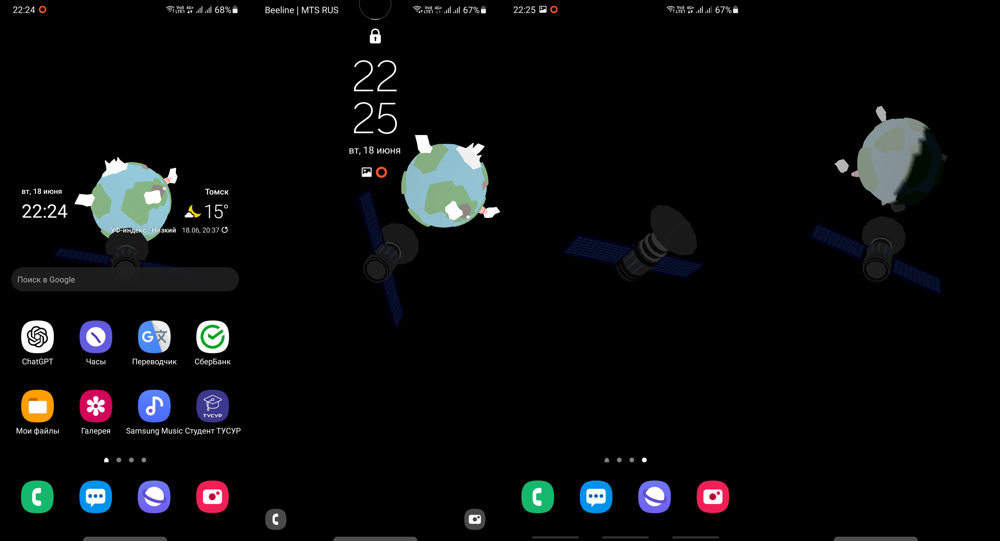

# :earth_americas: Satellite - Live Wallpaper

This is Android native application with 3D live wallpaper.
The scene contains two objects: the satellite on foreground and the earth.
It rotates basing on device orientation.

**Tech stack**: Kotlin, Android Framework, OpenGL ES.

## :bulb: How does it work?

At first, embedded in Android WallpaperService can't render OpenGL out of the box, 
so GLWallpaperService is used here (custom implementation by Robert Green).
Next, OpenGL has no feature to draw 3D models from files, therefore custom parser for Wavefront OBJ was implemented here.
And then, i figured out that OpenGL ES specification can render only triangles.
So, in order to draw complex polygons, primitive triangulation algorythm was implemented here.
And scene rotation bases on data from gravity sensor data from SensorManager API.

## :sparkles: Download

